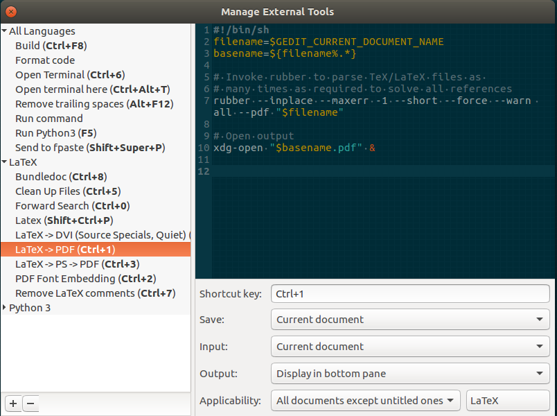

gedit-latex-external-tools
==========================

Capabilities of this tool set:

1. Removal of all auxiliary/temp files produced by LaTeX or by some LaTeX editors.
2. PDF font embedding
3. Forward and inverse search with `xdvi`
4. Terminal call
5. Running LaTeX as many times as necessary to generate `dvi` output or `pdf` output.

Requirements
============

1. Gedit External Tools plugin.
2. LaTeX wrapper `rubber`
3. DVI viewer `xdvi`

Installation Commands
=====================

1. `git clone https://github.com/bagustris/gedit-latex-external-tools.git`
2. `cd gedit-latex-external-tools`
3. `./install-latex-external-tools`

Usage and shorcuts
==================

1. Open a .tex file in Gedit
2. Go to the `Tools >> External Tools` menu and select one of the tools.
3. The following is the screenshot of the tools, the most important shortcut 
   is latex to pdf which is `Ctrl+1` in default setting.
   

Test
====

Tested in Ubuntu 14.94, Mate Desktop, and Gedit 3.18.3
